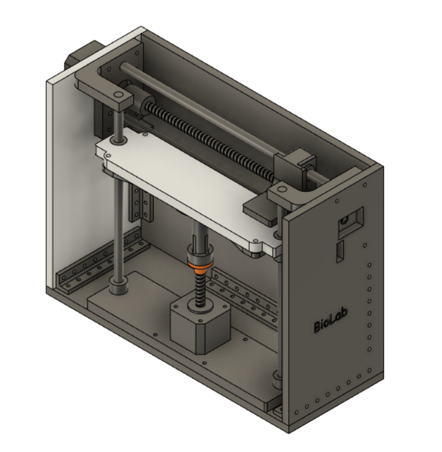

# Dynamic Tactile Data Acquisition Platform

### Overview

This repository hosts a Dynamic Tactile Data Acquisition Platform,  designed to facilitate tactile experiments across two axes (X and Z). It is a versatile tool aimed at researchers and engineers involved in tactile data collection and analysis.

### Features

- **Two-Axis Movement**: Precision-engineered to operate along both X and Z axes, ensuring comprehensive coverage for tactile experiments.
- **Dual Stepper Motors**: Employs two robust stepper motors, delivering smooth and accurate motion control.
- **Microcontroller**: Utilizes an STM32F401 MCU.
- **Integrated System Components**:
  - **Firmware**: C/C++ firmware for platform control.
  - **Software Interface**: A user-friendly Python-based software interface for movement planning and execution.
  - **Serial Communication**: Seamless serial communication protocol linking the software and firmware components.

### Repository Contents

- **Mechanical Structure 3D Files**: Detailed 3D models of the platform's mechanical structure for easy replication or modification.
- **Firmware Variants**: Two distinct firmware versions tailored to different stepper motor drivers.
- **Control Software**: Intuitive software designed for seamless interaction with the microcontroller unit.
- **PCB Design and Layout Files**: Comprehensive files for the printed circuit board (PCB) design.

### Getting Started

Please refer to the individual folders.

